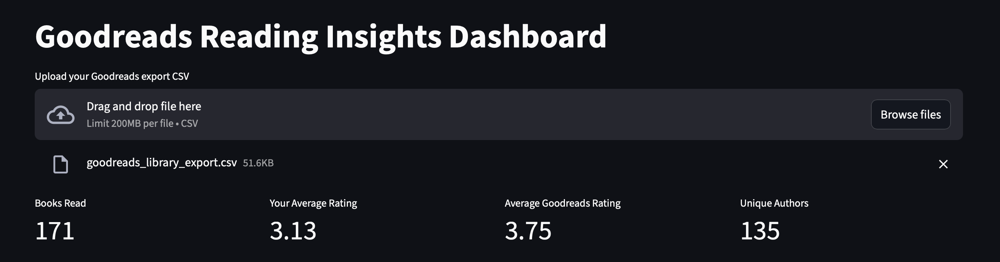
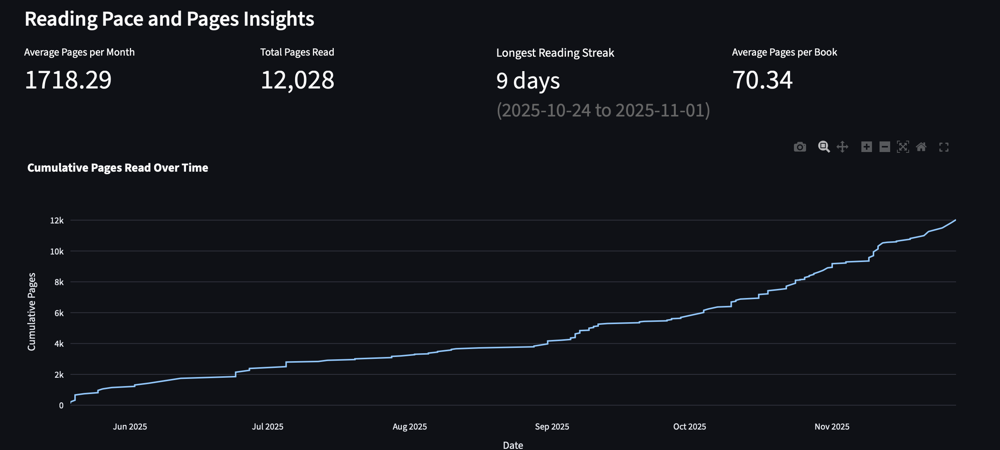
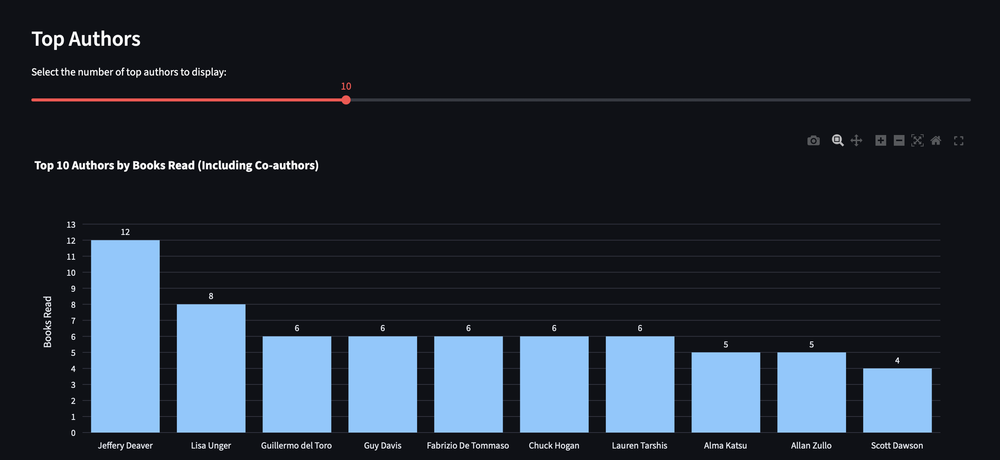
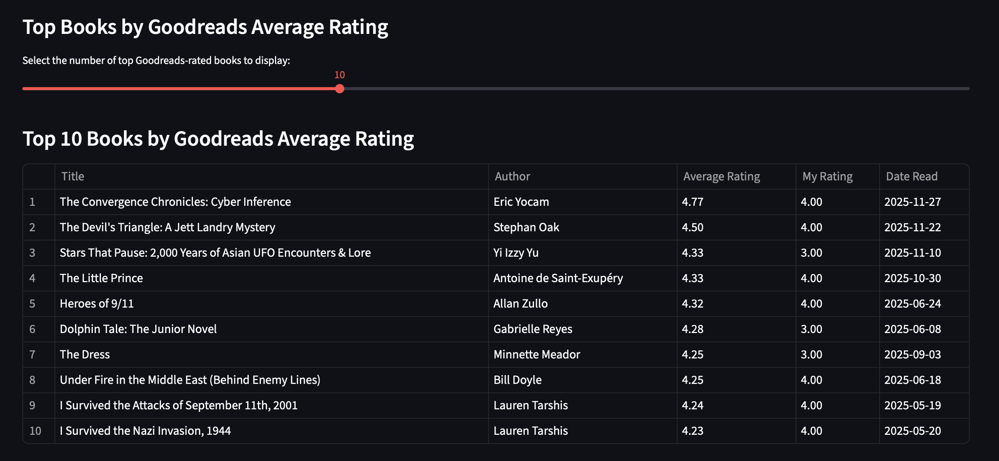
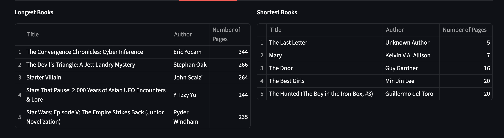
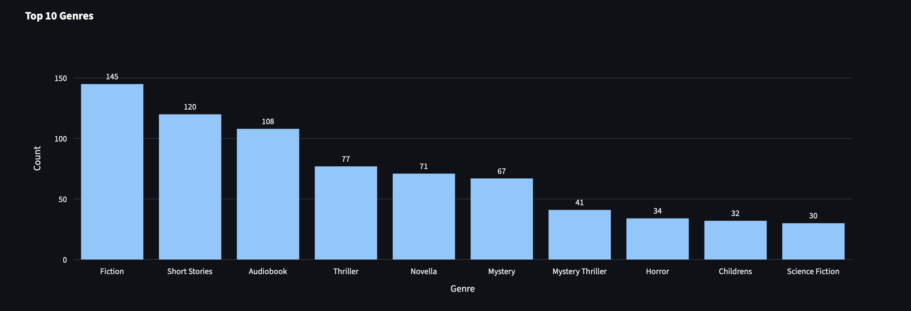
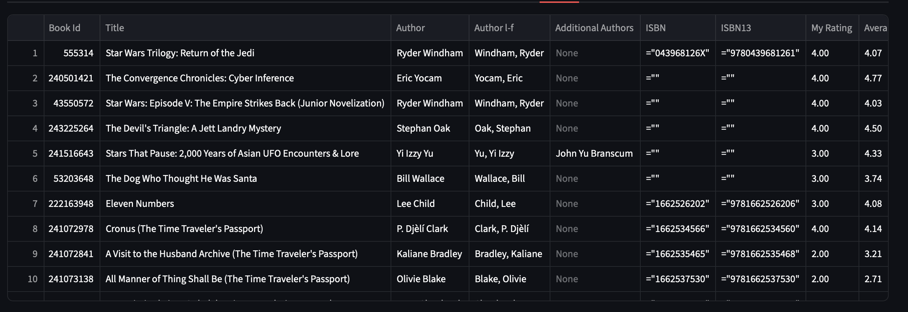

# Goodreads Reading Insights Dashboard

A comprehensive Streamlit-based dashboard for visualizing and analyzing your Goodreads reading data. Upload your Goodreads export CSV and gain deep insights into your reading habits, trends, and statistics.

## Features Overview

The dashboard is organized into several tabs, providing deep dives into different aspects of your reading data.

### Key Metrics (Displayed at the top)

* **Total Books Read**: Track the total number of books you've completed.
* **Your Average Rating**: View the average rating you've given to your books.
* **Community Average Rating**: Compare with the Goodreads community's average rating for your read books.
* **Unique Authors**: Discover the total number of unique authors you've read.



---

### Tab 1: Reading Pace

This section focuses on your reading speed and volume over time.

* **Metrics**: Average Pages per Month, Total Pages Read, Longest Reading Streak, and Average Pages per Book.
* **Chart**: Cumulative Pages Read Over Time (Line chart).



### Tab 2: Trends & Authors

Analyze your reading activity across years and explore your most-read authors.

* **Chart 1**: **Books Read Each Year** (Bar chart).
* **Chart 2**: **Top N Authors by Books Read** (Bar chart, including co-authors).
* **Interactive Table**: Select an author to view a detailed list of the books you've read by them.



### Tab 3: Publishers & Binding

Insights into the production aspects of your library.

* **Chart 1**: **Top N Publishers by Books Read** (Bar chart).
* **Chart 2**: **Binding Distribution** (Pie chart).
* **Chart 3**: **Books Read by Year of Publication** (Bar chart).


### Tab 4: Top Books

Showcases your highest-rated books and those with the highest community ratings.

* **Your Top Rated Books**: A table showing your top $N$ books based on your personal 'My Rating'.
* **Top Books by Goodreads Average Rating**: A table showing your top $N$ books based on the community's 'Average Rating'.



### Tab 5: Longest & Shortest Books

Identifies the books at the extremes of your collection's page counts.

* **Longest Books**: A table of the top 5 longest books by page count.
* **Shortest Books**: A table of the top 5 shortest books by page count.



### Tab 6: Enrich Data with Genres

A powerful feature to enhance your dataset by scraping genre information from Goodreads.

* **Functionality**: Uses multi-threaded web scraping via `enrich.py` to add a 'Genres' column to your DataFrame based on the book's 'Book Id'.
* **Output**: Allows you to **Download the Enriched CSV** and optionally save it to a local path.
* **Chart**: **Top N Genres** (Bar chart) based on the enriched data.



### Tab 7: Raw Data

Displays the full, processed DataFrame, which will include the enriched genre data if that feature was used.



## Installation

1. Clone the repository:

   ```bash
   git clone https://github.com/NathanKong06/Goodreads-Dashboard.git
   cd Goodreads-Dashboard
   ```

2. Install the required dependencies:

   ```bash
   pip install -r requirements.txt
   ```

3. Run the Streamlit app:

   ```bash
   streamlit run dashboard.py
   ```

## Usage

1. Export your Goodreads data as a CSV file:
   * Visit [Goodreads Import/Export](https://www.goodreads.com/review/import)
   * Follow the [instructions](https://help.goodreads.com/s/article/How-do-I-import-or-export-my-books-1553870934590) to export your library if needed.

2. Launch the dashboard:

   ```bash
   streamlit run dashboard.py
   ```

3. Upload your Goodreads CSV file using the file uploader in the app

4. Explore the various insights and visualizations provided

## File Structure

```text
Goodreads-Dashboard/
├── dashboard.py                # Main Streamlit application
├── insights_functions.py       # Data processing and visualization functions
├── enrich.py                   # Genre enrichment script
├── requirements.txt            # Python dependencies
├── README.md                   # This file
└── screenshots/               # Screenshot directory
    ├── metrics.png
    ├── trends.png
    ├── top-books.png
    ├── binding.png
    ├── genre.png
    ├── length-books.png
    ├── pace.png
    └── raw.png
```

## Dependencies

* Python 3.8+
* Streamlit - Web app framework
* Pandas - Data manipulation and analysis
* Plotly - Interactive visualizations
* BeautifulSoup4 - Web scraping (for enrichment)
* Requests - HTTP library (for enrichment)

See `requirements.txt` for specific versions.

## Features in Detail

### Data Processing

* Handles missing and zero-valued ratings
* Processes author lists including co-authors
* Validates required CSV columns
* Converts date formats and handles invalid dates
* Cleans publisher names with title casing

### Visualizations

* Interactive bar charts for reading trends and top authors
* Line charts for cumulative reading progress
* Pie charts for binding distribution
* Data tables for top-rated books
* Responsive layouts that adapt to different screen sizes

### Performance

* Caches expensive computations using Streamlit's `@st.cache_data`
* Efficient data filtering and aggregation
* Multi-threaded web scraping for genre enrichment (up to 8 concurrent requests)
