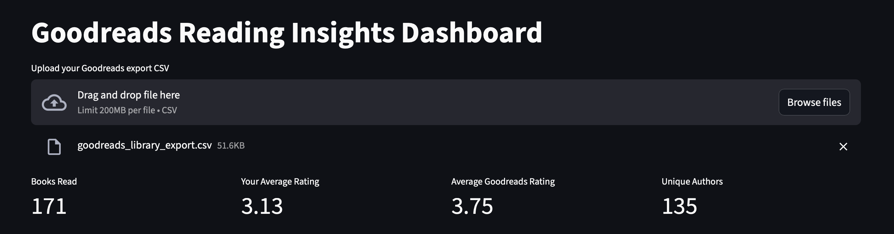
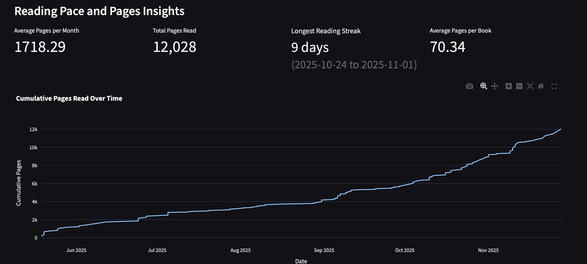
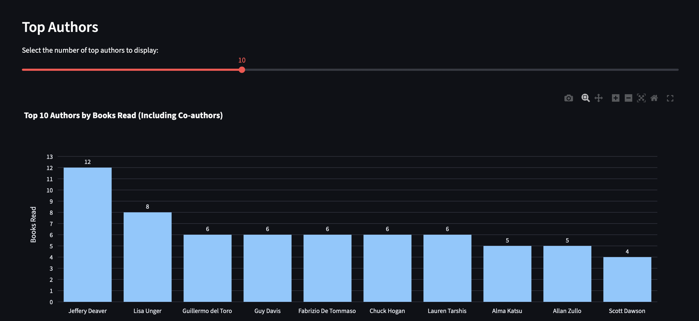
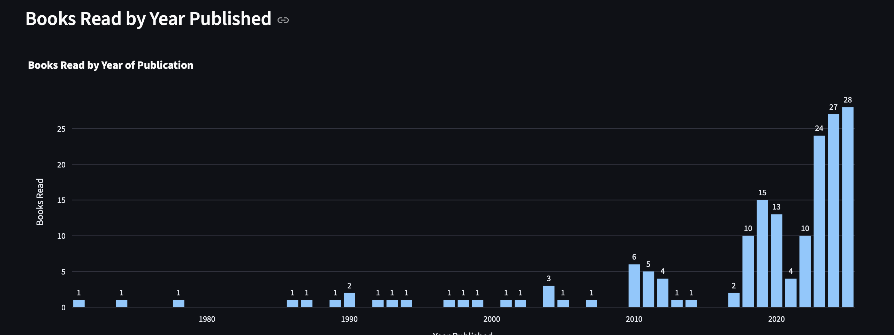
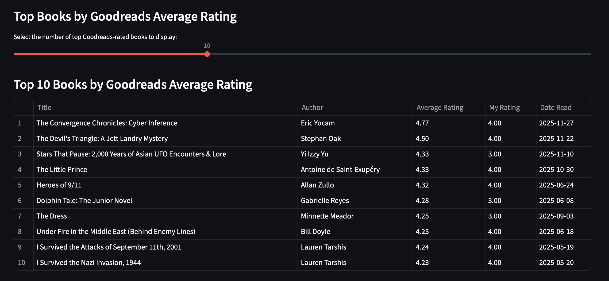
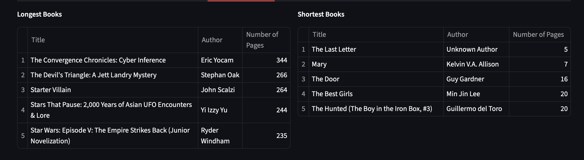
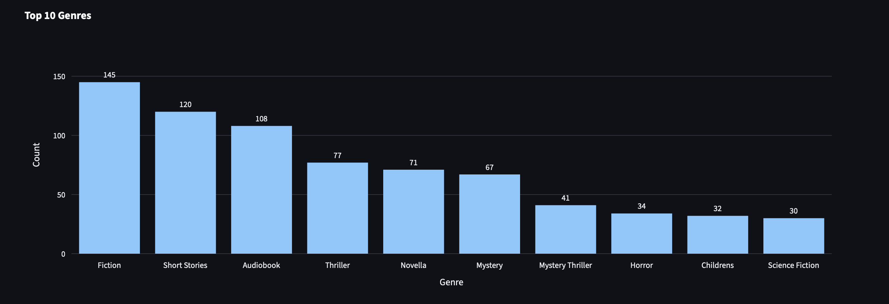
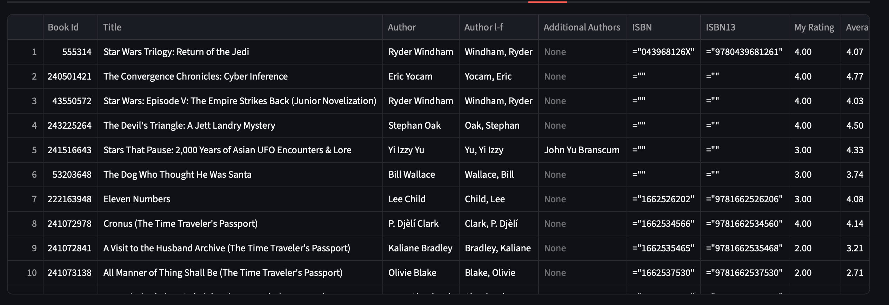

# Goodreads Reading Insights Dashboard

A Streamlit-based dashboard for visualizing and analyzing your Goodreads reading data. Upload your Goodreads export CSV to explore reading habits, trends, author patterns, and genre breakdowns — with automatic enrichment powered by live Goodreads scraping.

<https://goodreads-dashboard.streamlit.app>

---

## Features Overview

The dashboard is organized into several tabs, providing deep dives into different aspects of your reading data.

### Key Metrics *(always visible after upload)*

Four headline stats displayed at the top of every session:

- **Books Read** — total books on your "read" shelf (or with a `Date Read` value)
- **Your Average Rating** — your personal average star rating across read books
- **Average Goodreads Rating** — the community average for your read books (populated after enrichment)
- **Unique Authors** — count of distinct primary authors in your read list



---

### Tab 1 — Reading Pace

Focuses on reading speed and volume over time.

- **Average Pages / Month** — mean pages read across all calendar months with activity
- **Total Pages Read** — cumulative page count across all read books
- **Longest Reading Streak** — the longest consecutive-day run of finishing books, with start/end dates
- **Average Pages / Book** — total pages divided by total books (including books with no page count)
- **Chart** — *Cumulative Pages Read Over Time* (interactive line chart)



---

### Tab 2 — Trends & Authors

Analyze reading activity across years and drill into your most-read authors.

- **Books Read Each Year** — bar chart grouped by the year recorded in `Date Read`
- **Top N Authors by Books Read** — bar chart; use the **Include co-authors** toggle to count authors from the `Additional Authors` column as well
- **Author Explorer** — select any author from the chart to see a table of the books you read by them, sorted by `Date Read`



---

### Tab 3 — Publishers & Binding

Production-side insights into your library.

- **Top N Publishers** — bar chart of publishers by book count (publisher names are title-cased during preprocessing)
- **Binding Distribution** — pie chart of binding types (Paperback, Hardcover, etc.)
- **Books by Publication Year** — bar chart using `Original Publication Year`, falling back to `Year Published`
- **Publication Year Explorer** — select any year to view a table of the books you read that were published that year



---

### Tab 4 — Top Books

Tables of your highest-rated books from two perspectives:

- **Your Top N Rated Books** — sorted by `My Rating` (your personal star rating), zero and null ratings excluded
- **Top N Goodreads Community Books** — sorted by `Average Rating` (community score fetched during enrichment); shows a prompt to enrich if data is unavailable



---

### Tab 5 — Book Length

- **Longest Books** — top 5 books by `Number of Pages`
- **Shortest Books** — bottom 5 books by `Number of Pages`

Zero and null page values are excluded from both lists.



---

### Tab 6 — Enrich Data

Powered by `enrich.py`, which scrapes genre tags and average ratings from Goodreads automatically when a file is uploaded.

- **Enrichment** runs in the background using a multi-threaded pool (up to 8 concurrent requests); a progress bar tracks completion
- Only books on the "read" shelf (or with a `Date Read`) that lack genre data are fetched — already-enriched rows are skipped
- **Download Enriched CSV** — exports your full library with `Genres` and updated `Average Rating` columns added
- **Top N Genres** bar chart — counts individual genre tags across all enriched books



---

### Tab 7 — Raw Data

The full processed DataFrame displayed as an interactive table. Includes enriched `Genres` and `Average Rating` columns if enrichment has run.



---

## Installation

```bash
git clone https://github.com/NathanKong06/Goodreads-Dashboard.git
cd Goodreads-Dashboard
pip install -r requirements.txt
streamlit run dashboard.py
```

---

## Usage

1. Export your Goodreads data:
   - Go to [Goodreads Import/Export](https://www.goodreads.com/review/import) and click **Export Library**
   - See the [official guide](https://help.goodreads.com/s/article/How-do-I-import-or-export-my-books-1553870934590) if needed
2. Run `streamlit run dashboard.py`
3. Upload the CSV using the file uploader
4. Enrichment starts automatically — a progress bar shows status

---

## File Structure

```text
Goodreads-Dashboard/
├── dashboard.py                # Main Streamlit application
├── insights_functions.py       # Data processing and visualization functions
├── enrich.py                   # Genre enrichment script
├── requirements.txt            # Python dependencies
├── README.md                   # This file
└── screenshots/                # Screenshot directory
    ├── metrics.png
    ├── trends.png
    ├── top-books.png
    ├── binding.png
    ├── genre.png
    ├── length-books.png
    ├── pace.png
    └── raw.png
```

## Data Processing Notes

- **Ratings** — zero-valued `My Rating` entries are treated as unrated (`NaN`); `Average Rating` is coerced to numeric
- **Dates** — `Date Read` is parsed with `%m/%d/%Y` first, then falls back to pandas auto-detection; stored as `date` objects
- **Authors** — co-authors (from `Additional Authors`, comma-separated) are optionally included in author counts
- **Publishers** — title-cased during preprocessing
- **Pages** — zero values in `Number of Pages` are replaced with `NaN`; all page calculations drop missing values

---

## Dependencies

- **Python 3.8+**
- [Streamlit](https://streamlit.io/) — web app framework
- [Pandas](https://pandas.pydata.org/) — data manipulation
- [Plotly Express](https://plotly.com/python/plotly-express/) — interactive charts
- [BeautifulSoup4](https://www.crummy.com/software/BeautifulSoup/) — HTML parsing for enrichment
- [Requests](https://docs.python-requests.org/) — HTTP sessions for enrichment

See `requirements.txt` for pinned versions.

---

## Performance

- `@st.cache_data` is applied to all preprocessing and chart-generation functions to avoid redundant computation across reruns
- Enrichment uses `ThreadPoolExecutor` with up to 8 workers and a 2-second per-request delay to stay within Goodreads rate limits
- Enriched data is stored in `st.session_state` so it survives tab switches without re-fetching
